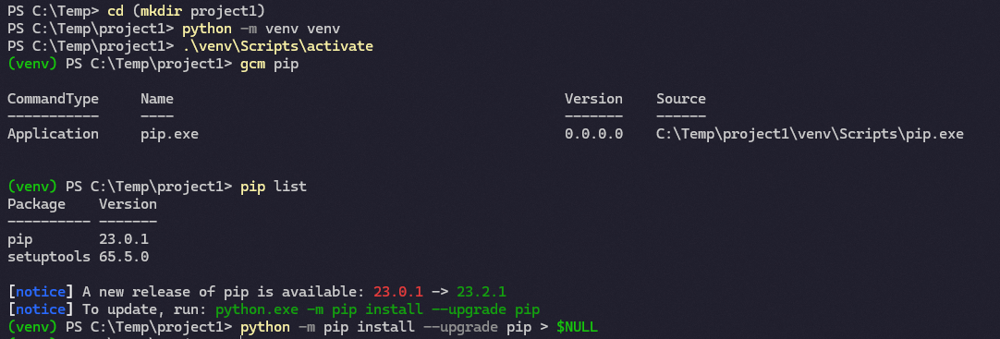
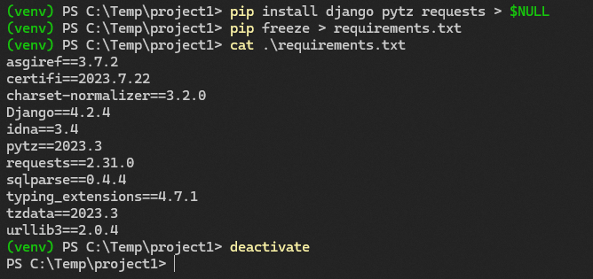
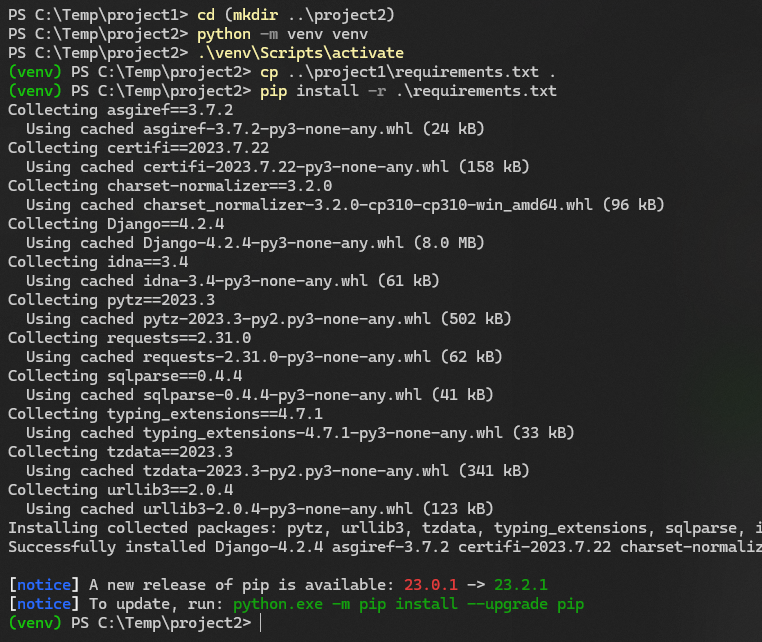
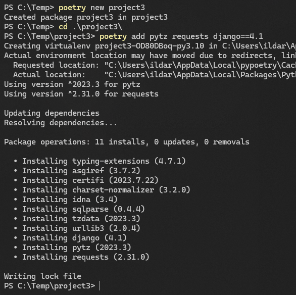
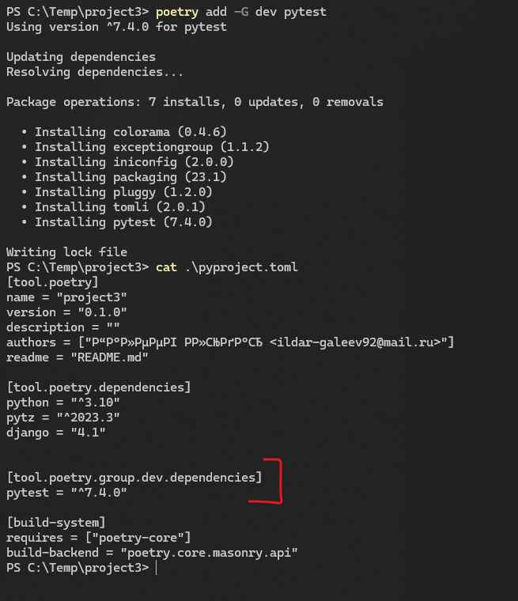
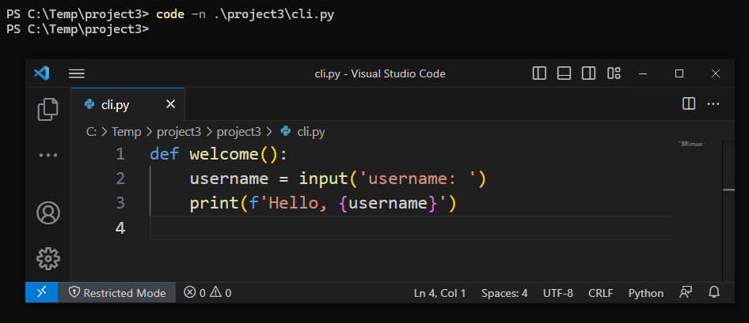
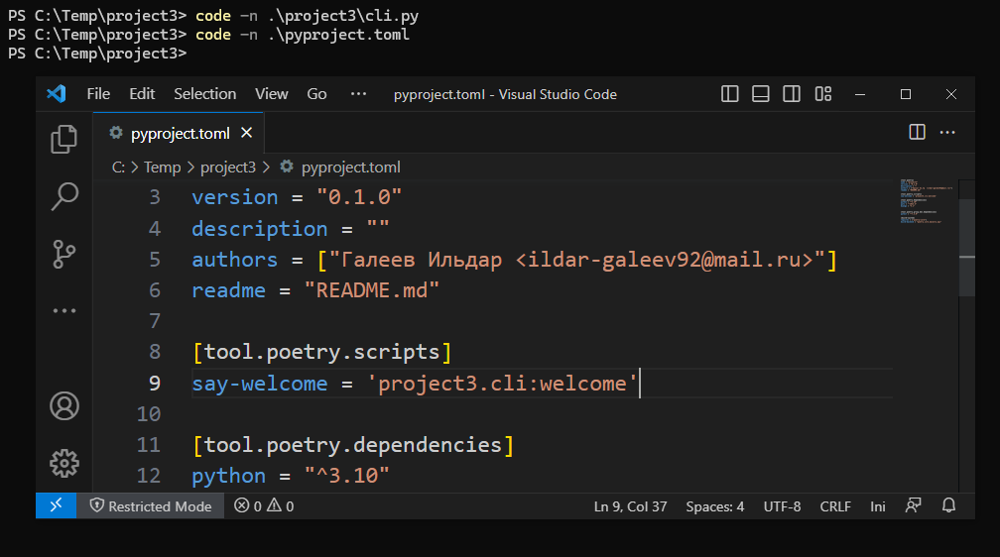
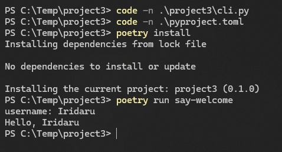
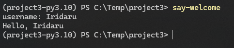

## Задание 1

``` powershell
# создаем и заходим в папку проекта
cd (mkdir project1)

# создаем виртуальное окружение
python -m venv venv

# активируем окружение
.\venv\Scripts\activate

# путь к исполняемому файлу pip
gcm pip

# список установленных пакетов
pip list
```



## Задание 2

``` powershell
# устанавливаем необходимые пакеты
pip install django pytz requests

# записываем список пакетов в файл "requirements.txt"
pip freeze > requirements.txt

# выходим из окружения
deactivate
```



## Задание 3

``` powershell
# создаем и заходим в папку проекта
cd (mkdir ..\project2)

# создаем виртуальное окружение
python -m venv venv

# активируем окружение
.\venv\Scripts\activate

# копируем файл "requirements.txt" из предыдущего проекта в текущую папку
cp ..\project1\requirements.txt .

# устанавливаем пакеты из списка "requirements.txt"
pip install -r .\requirements.txt
```



## Задание 4

``` powershell
# создаем новый проект в Poetry
poetry new project3
cd .\project3\

# устанавливаем необходимые пакеты при помощи Poetry
poetry add pytz requests django==4.1
```



``` powershell
# дерево установленных пакетов
poetry show --tree

# удаление "requests" из зависимостей
poetry remove requests

# обновленное дерево зависимостей
poetry show --tree

# проверка наличия обновлений для пакетов
poetry show --latest
```


``` powershell
# установка "pytest" в группу зависимостей "dev"
poetry add -G dev pytest
```



## Задание 5

``` powershell
# создаем файл скрипта в VSCode
code -n .\project3\cli.py
```



Добавляем функцию к скриптам `Poetry`

``` ini
[tool.poetry.scripts]
say-welcome = 'project3.cli:welcome'
```




``` powershell
# устанавливаем скрипт
poetry install

# запускаем скрипт
poetry run say-welcome
```



``` powershell
# то же из оболочки Poetry
poetry shell
say-welcome
```

